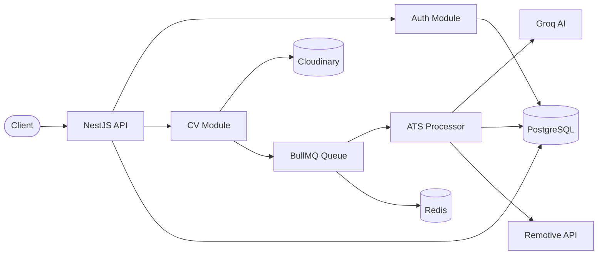

<p align="center">
  <h1 align="center">GradIQ</h1>
  <p align="center">
    AI-powered CV analysis platform for fresh graduates — score your resume, get actionable feedback, and improve your hireability.
  </p>
</p>

<p align="center">
  
  
  
  
  
  
</p>

---

## About

**GradIQ** is a backend API that helps fresh graduates evaluate and improve their CVs before they apply for jobs. Users upload a resume, and the platform extracts the text, runs it through an AI-powered ATS (Applicant Tracking System) analysis, and returns a structured score with strengths, weaknesses, missing keywords, and improvement suggestions.

Built with a production-minded stack: modular NestJS architecture, async job processing, OAuth authentication, and cloud file storage.

---

## Features

| Module                  | What it does                                                                                                                    |
| ----------------------- | ------------------------------------------------------------------------------------------------------------------------------- |
| **Authentication**      | Local sign-up/sign-in, JWT sessions, GitHub & Google OAuth, temporary tokens for OAuth onboarding                               |
| **CV Management**       | Upload PDF/DOCX resumes to Cloudinary, metadata storage, per-user CV library                                                    |
| **ATS Analysis**        | Background CV processing via BullMQ — text extraction → Groq AI (Llama 3.3 70B) → structured feedback                           |
| **User Management**     | Profile updates, role-based access (`USER` / `ADMIN`), linked OAuth provider accounts                                           |
| **Job Recommendations** | When ATS score is **≥ 90%**, fetches remote job listings from Remotive matched to the user's role and stores them for retrieval |

### Highlights

- **Async pipeline** — CV uploads return immediately; analysis runs in a Redis-backed queue with retries
- **AI feedback** — Score (0–100), strengths, suggestions, missing keywords, and vulnerabilities
- **Secure by default** — JWT guards, role guards, bcrypt password hashing, validated env config (Joi)
- **API docs** — Interactive Swagger UI at `/api-docs`
- **Smart job matching** — CV scores ≥ 90% unlock remote job recommendations matched to the user's role via Remotive
- **Container-ready** — Multi-stage Dockerfile + Docker Compose (Postgres, Redis, pgAdmin)

---

## Tech Stack

### Core

| Layer         | Technology                               |
| ------------- | ---------------------------------------- |
| Runtime       | Node.js 20                               |
| Framework     | NestJS 11                                |
| Language      | TypeScript                               |
| Database      | PostgreSQL 16                            |
| ORM           | Drizzle ORM + Drizzle Kit migrations     |
| Cache / Queue | Redis 7 + BullMQ                         |
| AI            | Groq SDK — Llama 3.3 70B                 |
| File storage  | Cloudinary                               |
| Auth          | Passport.js (Local, JWT, GitHub, Google) |

### Supporting

- **Validation** — class-validator, class-transformer, Zod, Joi
- **Docs** — Swagger / OpenAPI
- **File parsing** — pdf-parse, mammoth (PDF & DOCX)
- **Job listings** — Remotive public API (remote jobs)
- **DevOps** — Docker, Docker Compose
- **Testing** — Jest, Supertest

---

## Architecture



**CV analysis flow**

1. User uploads a CV (authenticated)
2. File is stored on Cloudinary; record saved in Postgres
3. A `process-cv` job is enqueued in BullMQ
4. Worker downloads the file, extracts text (PDF/DOCX)
5. Groq AI returns ATS score and feedback
6. Results persisted — fetch via `GET /ats/:cvId`
7. If score **≥ 90%**, remote jobs are fetched from Remotive using the user's role and saved as recommendations

---

## API Overview

| Method | Endpoint                | Description                                               |
| ------ | ----------------------- | --------------------------------------------------------- |
| `POST` | `/auth/register`        | Register with email & password                            |
| `POST` | `/auth/signIn`          | Local login → JWT                                         |
| `GET`  | `/auth/github`          | GitHub OAuth                                              |
| `GET`  | `/auth/google`          | Google OAuth                                              |
| `POST` | `/auth/logout`          | Invalidate session                                        |
| `POST` | `/cv/upload`            | Upload CV (multipart)                                     |
| `GET`  | `/cv/:cvId`             | Get CV by ID                                              |
| `GET`  | `/cv/user/:userId`      | List user's CVs                                           |
| `GET`  | `/ats/:cvId`            | Get ATS analysis (+ job recommendations when score ≥ 90%) |
| `GET`  | `/users/getUserByToken` | Current user profile                                      |

Full interactive documentation: **`http://localhost:3000/api-docs`**

---

## Getting Started

### Prerequisites

- Node.js 20+
- PostgreSQL 16
- Redis 7
- Accounts / keys for: Cloudinary, Groq, GitHub OAuth, Google OAuth

### Installation

```bash
git clone https://github.com/mohamed-ghanem1212/GradIQ.git
cd grad-iq
npm install
```

### Database migrations

```bash
npm run start:migrate
```

### Run locally

```bash
# development (watch mode)
npm run start:dev

# production build
npm run build
npm run start:prod
```

### Run with Docker Compose

```bash
docker compose up --build
```

App: `http://localhost:3000` · pgAdmin: `http://localhost:5050`

---

## Scripts

| Command                 | Description                |
| ----------------------- | -------------------------- |
| `npm run start:dev`     | Dev server with hot reload |
| `npm run build`         | Compile TypeScript         |
| `npm run start:prod`    | Run production build       |
| `npm run start:migrate` | Apply Drizzle migrations   |
| `npm run test`          | Unit tests                 |
| `npm run test:e2e`      | End-to-end tests           |
| `npm run lint`          | ESLint                     |

---

## Project Structure

```
grad-iq/
├── src/
│   ├── modules/
│   │   ├── auth/          # Registration, login, OAuth
│   │   ├── users/         # User profiles & roles
│   │   ├── cv/            # Upload, storage, queue dispatch
│   │   ├── ats/           # AI analysis & BullMQ worker
│   │   └── jobOffer/      # Remote job recommendations (score ≥ 90%)
│   ├── db/
│   │   ├── schema/        # Drizzle table definitions
│   │   └── drizzle/       # SQL migrations
│   ├── config/            # Env validation & service configs
│   └── common/            # Guards, strategies, filters, interceptors
├── test/                  # E2E tests
├── docker-compose.yml
└── src/docker/dockerfile  # Multi-stage production image
```

---

## License

UNLICENSED — private project.

---

## Share on LinkedIn

Copy the post below for your LinkedIn announcement.

<p align="center">
  Built with NestJS · GradIQ © 2026
</p>
